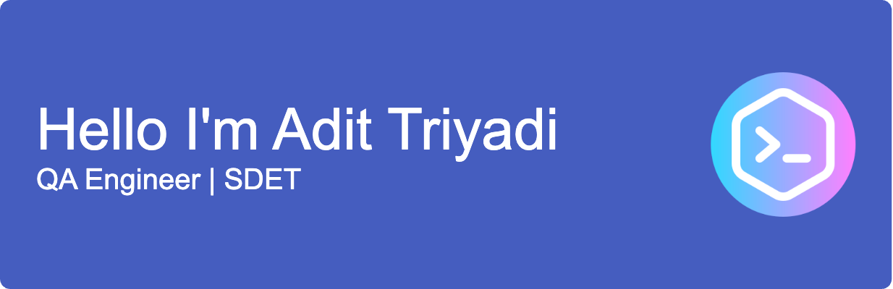

<!-- <h1 align="center">Hi, I'm Adit Triyadi 👋</h1>

QA Engineer | Automation Enthusiast | 6+ Years Experience
 -->

## 👨‍💻 About Me

Detail oriented and analytical QA Engineer with 6+ years of experience in both manual and automation testing for mobile and web applications. Skilled in designing test cases, managing test execution, and building automation scripts to streamline regression testing and reduce repetitive effort.

Successfully contributed to multiple high-quality product releases by ensuring strong test coverage and collaborating closely with cross-functional teams including developers, product managers, and designers.

Known for strong communication skills, collaborative mindset, and a keen attention to detail. Able to approach problems analytically and adapt quickly to new tools and workflows as a fast learner.

## 🥇 Programming Skills
##### Proficient In:

##### Familiar With:
    

## 🥇 Automation Frameworks
     

## ✉️ Connect with me
